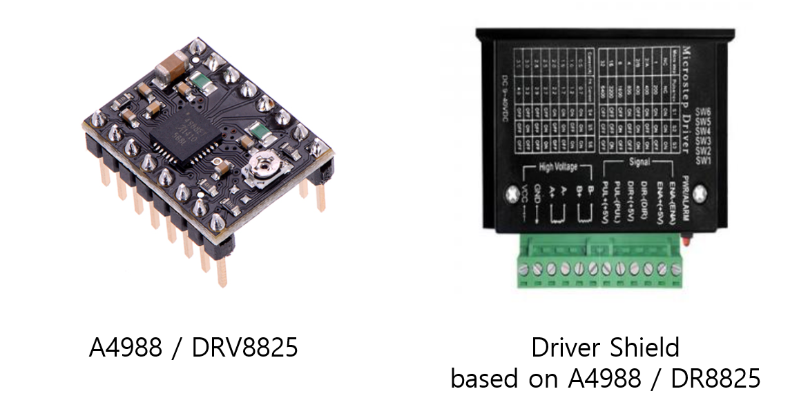

# LAB: Stepper Motor

**Date:** 2026-09-02

**Author/Partner:** YOUR NAME GOES HERE

**Demo Video:** Youtube link

**PDF version:**


# Introduction

In this lab, we will learn how to drive a stepper motor using the digital GPIO outputs of an MCU. You will use a Finite State Machine (FSM) to design the algorithm for stepper motor control.

You must submit

* LAB Report (\*.pdf & \*.md)
* Zip source files(main\*.c, ecRCC.h, ecGPIO.h, ecSysTick.c etc...).
  * Only the source files. Do not submit project files

### Requirement

#### Hardware

* MCU
  * NUCLEO-F411RE
* Actuator/Sensor/Others:
  * **Tutorial:** 
    * Stepper Motor SM-42BYG011  (12V)
    * Motor Driver A4988 
  * **Lab:** 
    * Stepper Motor 28BYJ-48  (5V)
    * Motor Driver ULN2003 
  * breadboard

#### Software

* Keil uVision, CMSIS, EC\_HAL library

***


# Tutorial: 
## Tutorial 1: Stepper Motor with  Motor Driver (A4988)

A simple method to drive a stepper motor is using a motor driver that receives only a pulse and direction pin. 

* **A4988 motor driver** [A4988 spec sheet](https://www.makerguides.com/wp-content/uploads/2019/02/A4988-Datasheet.pdf)
* **DRV8825**
* Any motor shield based on A4988, DRV8825


This can also change the micro-stepping configuration easily. For more information, read





The stepper motor for the tutorial can be any unipolar or bipolar (<24V)

* Stepping Motor  (Bipolar 12V, [SM-42BYG011-25](https://cdn.sparkfun.com/assets/3/0/f/6/1/SM-42BYG011-25.pdf)) 
* Stepping Motor   (5V,  KH4248 b90112: [spec sheet](https://www.icbanq.com/icdownload/V2_DATA/ICBShop/Board/\[1]KH42-series.pdf)) etc


### Connection Diagram

1. Connect the motor driver and the stepper motor as follows.
1. Supply 8V from a power supply to VMOT(#16 on Driver)


| Functions | Motor | Driver              | MCU-Arduino | MCU-STMf411 |
| --------------------------- | ----- | ------------------- | ----------- | ----------- |
| Step                        |       | #7                  | D2          | PA_10 |
| Direction                   |       | #8                  | D3          | PB_3 |
| VDD (MCU 5V)                |       | #9 | 5V          | +5V |
| VDD_GND (MCU GND)           |       | #10 | GND         | GND |
| Vmotor  (PowerSupply)       |       | #16 to Power(8V), Capacitor 100uF (pin#15-16) |             |             |
| Vmotor_GND (PowerSupplyGnd) |       | #15 to Power(GND)   |             |             |
| Motor A, A' | A: RED, A':GRN | #12 to A,   #11 to A' |||
| Motor B, B' | B: YEL, B':BLU | #13 to B,   #14 to B' |||
| Others |  | #5(RST) to #6(SLP) |||

> DO NOT connect pin#15 to pin#9 (MCU\_GND)!!
>
> 
>
> Motor wire Color code can be different. Just find the pair A-A' and B-B'
>
> B1-B2: the samewiring,  A1-A2: the same wiring
>
> It does not matter to invert the motor wiring A-A’ (pin A1-A2) to A’-A (pin A1-A2)


<figure><figcaption></figcaption></figure>

<figure><figcaption></figcaption></figure>


#### For Arduino
Create a new project under the directory `tutorial\`

Open _Arduino IDE_ and Create a new program named as ‘**TU\_arduino\_Stepper.ino**’.

#### For STM M4
Create a new project under the directory `tutorial\`

Create a new program named as ‘**TU\_Stepper_Motor.c**’.


**Run the sample code** 






```c
// Run Stepper Motor with A4998  

int x; 
#define BAUD (9600)
const int dirPin = 2;
const int stepPin = 3;
const int enablePin = 6;


void setup() 
{
  Serial.begin(BAUD);
  pinMode(enablePin,OUTPUT); // Enable
  pinMode(stepPin,OUTPUT); // Step
  pinMode(dirPin,OUTPUT); // Dir
  digitalWrite(enablePin,LOW); // Set Enable low
}

void loop() 
{
  digitalWrite(dirPin, HIGH);// Set Dir high (CW)
  Serial.println("Loop 200*5 steps (1*5 rev)");
  for(x = 0; x < 1000; x++) // Loop 200 times
  {
    digitalWrite(stepPin,HIGH); // Output high
    delay(10); // Wait
    digitalWrite(stepPin,LOW); // Output low
    delay(10); // Wait
  }
  Serial.println("Pause");
  delay(1000); // pause one second
}


```






```c
#include "stm32f411xe.h"
#include "ecRCC2.h"
#include "ecGPIO2.h"
#include "ecSysTick2.h"  

#define MOTOR_DIR PB_3  
#define MOTOR_PULSE PA_10

void setup(void)
{
	RCC_PLL_init();                
    SysTick_init(); 
    GPIO_init(MOTOR_DIR, OUTPUT);      
    GPIO_init(MOTOR_PULSE, OUTPUT);      
}


int main(void) {	    
	setup();
	while(1){
          for(x = 0; x < 1000; x++) // Loop 200 times
		  {
            GPIO_write(MOTOR_PULSE, HIGH);        
        	delay_ms(10);
	        GPIO_write(MOTOR_PULSE, LOW);        
	        delay_ms(10);
          }
        delay_ms(1000);
	}
}


```








# Problem : Stepper Motor Control with FSM (4-input sequence)

## Problem Description

For the lab, we are going to use another type of stepper motor driver that requires a sequence of 4-input pulses as the input. 

* **Driver:** **ULN2003 motor driver.**[ULN2003 spec sheet](https://www.electronicoscaldas.com/datasheet/ULN2003A-PCB.pdf)

* **Motor:** 28BYJ-48, Search for the spec sheet

  

  


1. Find out the number of steps required to rotate 1 revolution of the stepper motor with Full-steppping.
2. Then, rotate the stepper motor 5 revolutions with 1 rpm. 
3. Repeat the above process in the opposite direction.
4. Increase and decrease the speed of the motor as fast as it can rotate to find the maximum and minimum speed of the motor.
5. Apply the half-stepping and repeat the above.


## FSM design for Stepper Motor Sequence

We are going to apply the finite state machine method to drive a stepper motor. 

You must read [Tutorial: FSM programming ](../tutorial/tutorial-finite-state-machine-programming.md)for hints


[tutorial-finite-state-machine-programming.md](../tutorial/tutorial-finite-state-machine-programming.md)



### State Table for Full-Stepping 

Fill-in the blanks of the given tables


**Full-stepping sequence**

<figure><figcaption></figcaption></figure>


**State Table**: Moore FSM


### State Table for Half-Stepping 

**Half-stepping sequence**

<figure><figcaption></figcaption></figure>


* **State Table**: Moore FSM


## Programming FSM 

#### Preparation

* Download files:
  * [ecStepper\_student.h, ecStepper\_student.c](https://github.com/ykkimhgu/EC-student/blob/main/include/lib-student/)

* Change the library files as `ecStepper.h, ecStepper.c`
* Write your name and modified date in the comment section

* must update your header files located in the directory `include\`.

* Create a new project under the directory `EC\lab\`

  - Environment: “**LAB\_Stepper\_Motor”**

  - Source File: “**LAB\_Stepper\_Motor.c”**

* You must modify the `platformio.ini` **,** to add new environment.

> You MUST write your name in the top of the source file, inside the comment section.


#### Function Definitions

Fill-in the blanks in the header files to complete the definitions for the provided functions






```c
//State number 
typedef enum {
	S0, S1, S2, S3, S4, S5, S6, S7
} StateNum;


// Stepping sequence  - FSM
typedef struct {	
  uint32_t next[2];
  uint8_t out[4];
} StateStepper_t;

// Initialization of Stepper Motor
void stepper_init(uint32_t mode, PinName_t *pinStepper);

// Converts Motor [rpm] to step delay in [msec]
void stepper_speed (uint32_t speedRPM);

// Run Stepper Motor for given steps and direction
void stepper_step(uint32_t steps, uint32_t direction);

// Stepper Motor Output for given state
void stepper_out(uint32_t state);

// Stop Stepper Motor
void stepper_stop(void);


```






```c
static PinName_t _stepperPins[4];

// State number structure
typedef enum {
	S0, S1, S2, S3, S4, S5, S6, S7
} stateNum;

//FULL stepping sequence  - FSM
typedef struct {
  	uint32_t next[2];
	uint8_t out[4];
} State_full_t;


// State Table Definition (Moore)
State_full_t FSM_full[4] = {  	// 1010 , 0110 , 0101 , 1001
 	{{S1,S3},{1,1,0,0}},		// ABA'B'
 	// YOUR CODE
 	// YOUR CODE
 	// YOUR CODE
};


void Stepper_init(PinName_t *pinStepper){ 
	for (int i=0; i<4; i++){
		_stepperPins[i] = pinStepper[i];
		// [YOUR CODE GOES HERE!!]
	}
}


```








> Note that these are **blocking** stepper controllers.
>
> While the stepper is running, the MCU cannot process other polling commands. If you can, modify it to be the non-blocking controller.

> You can also create your own functions different from the given instructions.


### Code

Your code goes here: [ADD Code LINK such as github](https://github.com/ykkimhgu/EC-student/)

Explain your source code with necessary comments.

```
// YOUR MAIN SOURCE CODE ONLY
// YOUR CODE
```

**Sample Code : Stepper Motor**



```cpp
#include "stm32f411xe.h"
#include "ecGPIO.h"
#include "ecRCC.h"
#include "ecEXTI.h"
#include "ecSysTick.h"
#include "ecStepper.h"

PinName_t pinStepper[4]    = {PB_10,PB_4,PB_5,PB_3};

// Initialiization 
void setup(void){	
	RCC_PLL_init();                                 // System Clock = 84MHz
	SysTick_init();                                 // Systick init
	
	GPIO_init(BUTTON_PIN, EC_DIN);           		// GPIOC pin13 initialization
    EXTI_init(BUTTON_PIN, FALL,0);           		// External Interrupt Setting

	Stepper_init(pinStepper); 						// Stepper GPIO pin initialization
	Stepper_setSpeed(2);                          	//  set stepper motor speed
}


int main(void) { 
	// Initialiization --------------------------------------------------------
	setup();
	
	Stepper_step(2048, 1, FULL);  // (Step : 2048, Direction : 0 or 1, Mode : FULL or HALF)
	
	// Inifinite Loop ----------------------------------------------------------
	while(1){;}
}


void EXTI15_10_IRQHandler(void) {  
	if (is_pending_EXTI(BUTTON_PIN)) {
		Stepper_stop();
		clear_pending_EXTI(BUTTON_PIN); // cleared by writing '1'
	}
}

```



### Configuration

| Function     | Pins                        | Configuration |
| ------------ | --------------------------- | ------------- |
| A, A', B, B' | <p>PB10, PB4, PB5, PB3<br/> | DOUT, FAST    |


### Connection Diagram

Read the specification sheet of the motor and the motor driver for wiring and min/max input voltage/current.


<figure><figcaption></figcaption></figure>


### Discussion

1.  Find out the trapezoid-shape velocity profile for a stepper motor. When is this profile necessary?

    > Answer discussion questions
2.  How would you change the code more efficiently for micro-stepping control? You don’t have to code this but need to explain your strategy.

    > Answer discussion questions
3. There are other types of Stepper Motor Drivers that are simple to use, such as you only give one pulse signal and direction, instead of giving 4 pulse signals. Such examples are A4988, DRV 8834, and TB6600 drivers. Compare these motor drivers with ULN2003 in terms of operating method.

> Answer discussion questions


### Results

Experiment images and results

> Show experiment images /results

Add [demo video link](https://github.com/ykkimhgu/course-doc/blob/master/course/lab/link/README.md)

## Reference

Complete list of all references used (github, blog, paper, etc)

## Troubleshooting

(Option) You can write Troubleshooting section
