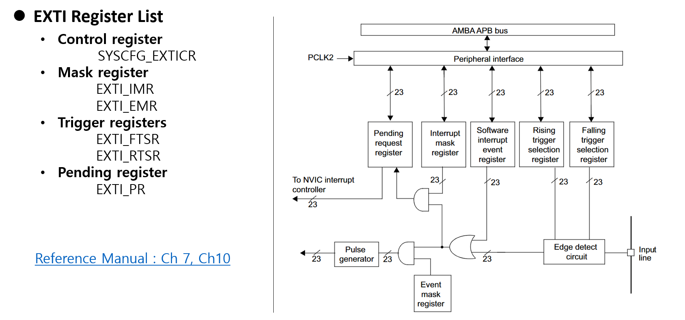
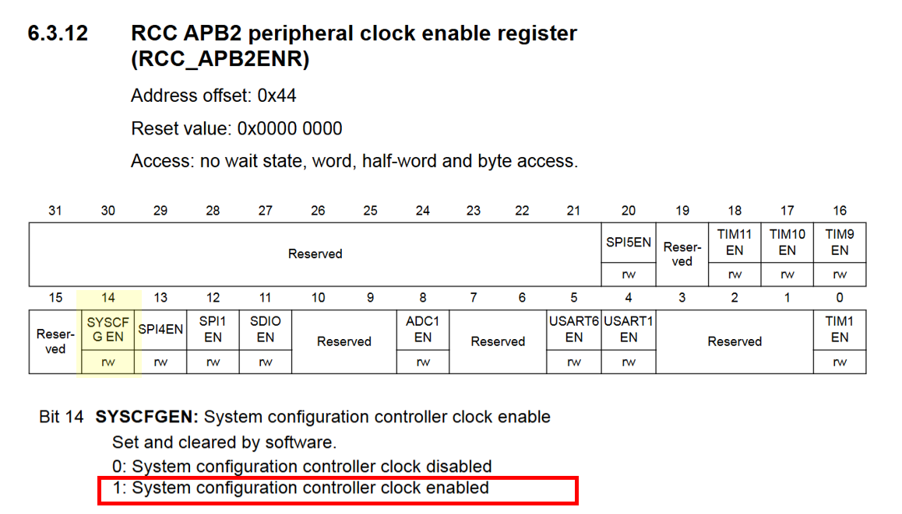
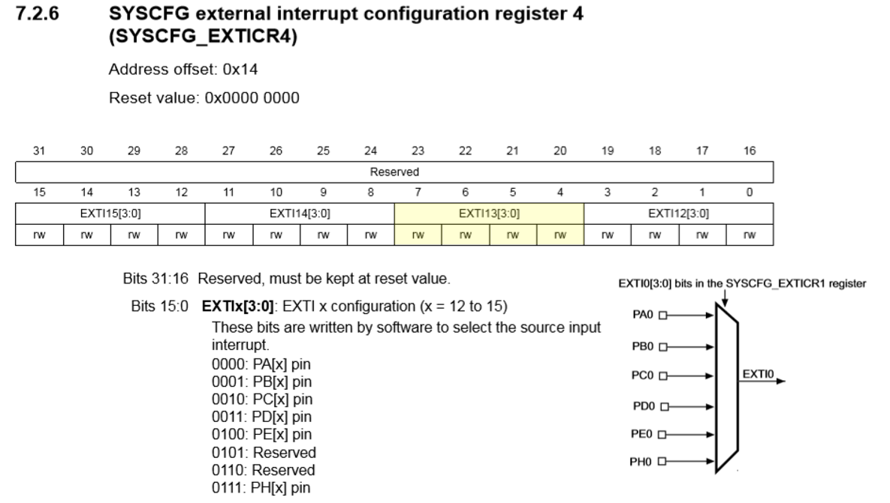

# PreLAB: External Interrupt

**Date:** 2026-09-02

**Author/Partner:** YOUR NAME GOES HERE

**Demo Video:** Youtube link

**PDF version:**

***

## Introduction

In this tutorial, we will learn how to use External Interrupt. We will create functions that capture the falling edge trigger by pushing a button using an external interrupt.

The objectives of this tutorial are how to

* Configure External input (EXTI) interrupt with NVIC
* Create your own functions for configuration of interrupts

**Submit the Pre-Lab report**

#### Hardware

* NUCLEO -F411RE

#### Software

* VS code, CMSIS, EC\_HAL

#### Documentation

* [STM32 Reference Manual](https://ykkim.gitbook.io/ec/stm32-m4-programming/hardware/nucleo-f411re#manual-documentation)

## Overview of External Interrupt (EXTI)

#### A. Register List

List of external interrupt (EXTI) registers



```c
typedef struct
{
  __IO uint32_t IMR;    // EXTI Interrupt mask register
  __IO uint32_t EMR;    // EXTI Event mask register
  __IO uint32_t RTSR;   // EXTI Rising trigger selection register
  __IO uint32_t FTSR;   // EXTI Falling trigger selection register
  __IO uint32_t SWIER;  // EXTI Software interrupt event register
  __IO uint32_t PR;     // EXTI Pending register
}EXTI_TypeDef
```

#### B. Register Setting

**1. GPIO:Select & Initialize GPIO Port**_**y**_&#x50;i&#x6E;_**x**_**&#x20;for EXTIx**

* mode = INPUT

**2. EXTI Setting**

* Enable SYSCFG peripheral clock. **RCC->APB2ENR**
* Select GPIO Port _y_ to EXTI: **SYSCFG->EXTICR**
* Configure the trigger edge. **EXTI->FTSR or RTSR**
* Enable EXTI: **EXTI->IMR**
  * Not-mask Interrupt request

**3. NVIC**&#x20;

* `NVIC_SetPriority()`
* `NVIC_EnableIRQ()`

**4. EXTI handler**

* is\_pending ? Then `EXTIx_IRQHandler()`
* clear\_pending when finished

## Exercise&#x20;

### A. Exercise 1: Register Configuration

Fill in the blanks below

**Assumption:**

`#define BUTTON_PIN PA_4 //EVAL board JKIT`

#### EXTI GPIO Pin initialization

* Push-Button: Port A Pin 4 / Input / PU

```c
// Use your API library  GPIO


```

#### EXTI Configuration

1. **Enable EXTI Clock with SYSCFG controller clock**

*   **RCC\_APB2ENR:** SYSCFGEN

    ```c
    // SYSCFG peripheral clock enable
    RCC->APB2ENR |= __________________
    ```


    <figure><figcaption></figcaption></figure>


2.**Connect EXTI to the GPIO Port\_y Pin\_x**

* **SYSCFG\_EXTICR2:** EXTIx
*   Connect PA\_4(push-button) to EXTI4 line (given code)

    ```c

    	// Button: PA_4 -> EXTICR2(EXTI4)
    	// Pin 4~7: EXTICR2 // EXTICR[1]

    	SYSCFG->EXTICR[1] &= ~(0xFUL << 4);
    	SYSCFG->EXTICR[1] |=  0UL<<4;

    	// These are the same as
    	SYSCFG->EXTICR[1] &= ~SYSCFG_EXTICR2_EXTI4;  
    	SYSCFG->EXTICR[1] |= SYSCFG_EXTICR2_EXTI4_PA;
    ```

<figure><figcaption></figcaption></figure>

*   **Generalize of Connecting Port y, Pin x to EXTIx**

    ```c
    // Connect EXTI to the GPIO Port_y Pin_x	
    	// Pin 0~3: EXTICR1 // EXTICR[0]
    	// Pin 4~7: EXTICR2 // EXTICR[1]
    	// Pin 8~11: EXTICR3 // EXTICR[2]
    	// Pin 12~15: EXTICR4 // EXTICR[3]

    	uint32_t EXTICR_port=0;
    	if		(Port == GPIOA) EXTICR_port = 0;
    	else if	(Port == GPIOB) EXTICR_port = 1;
    	else if	(Port == GPIOC) EXTICR_port = 2;
    	else if	(Port == GPIOD) EXTICR_port = 3;
    	else					EXTICR_port = 4;
    	
    	SYSCFG->EXTICR[_______] &= ________________;			// clear 4 bits
    	SYSCFG->EXTICR[_______] |= ________________;			// Set 4 bits	
    ```

> HINT 1 : mod(pin,4) \* 4, (int)(pin/4)
>
> HINT 2 : Find the pattern in the binary representations

| **Bit Starting Position** | **Pin y**      |                |                |
| ------------------------- | -------------- | -------------- | -------------- |
|                           | **EXTICR\[0]** | **EXTICR\[1]** | **EXTICR\[2]** |
| Bit 0                     | 0 (b00**00**)  | 4 (b01**00**)  | 8 (b10**00**)  |
| Bit 4                     | 1 (b00**01**)  | 5 (b01**01**)  | 9 (b10**01**)  |
| Bit 8                     | 2 (b00**10**)  | 6 (b01**10**)  | 10 (b10**10**) |
| Bit 12                    | 3 (b00**11**)  | 7 (b01**11**)  | 11 (b10**11**) |


3. **Select Trigger Edge (RISE, FALL, BOTH)**

*   **EXTI\_FTSR:** TRx or **EXTI\_RTSR:** TRx

    ```c
    	// Select  Trigger edge (RISE, FALL, BOTH)
    	if (trig_type == FALL) 		EXTI->FTSR |= 1UL << __________;  // Falling trigger enable 
    	else if	(trig_type == RISE) EXTI->RTSR |= 1UL << __________;   // Rising trigger enable 
    	else if	(trig_type == BOTH) {			// Both falling/rising trigger enable
    		EXTI->RTSR |= _______; 
    		EXTI->FTSR |= _______;
    ```

    

4. **Enable EXTI: Not-masking Interrupt request**

* **EXTI\_IMR:** MRx
  * Enabling == not-masking

```c
	// Enable EXTI, with Not-Masked Interrupt Request 
	// Not-mask (==Enable) EXTIx
 	EXTI->IMR |= 1UL << ___________;
```


#### EXTI\_NVIC

* Search for "**Vector table for STM32F411xC/E** " in Reference Manual
* Fill-in the blanks in the table for EXTI 0 to EXT 15

<table data-search="false"><thead><tr><th>EXTIx</th><th>ISR (handler)</th><th>IRQn (keyword, stm32f111xe.h)</th><th>IRQn</th></tr></thead><tbody><tr><td>EXTI0</td><td>EXTI0_IRQHandler()</td><td>EXTI0_IRQn</td><td>6</td></tr><tr><td>EXTI1</td><td></td><td>EXTI1_IRQn</td><td></td></tr><tr><td>EXTI2</td><td></td><td></td><td></td></tr><tr><td>EXTI3</td><td></td><td></td><td></td></tr><tr><td>EXTI4</td><td></td><td></td><td></td></tr><tr><td>EXTI5_9</td><td></td><td></td><td></td></tr><tr><td>EXTI10_15</td><td>EXTI15_10_IRQHandler()</td><td>EXTI15_10_IRQn</td><td>40</td></tr></tbody></table>

* Fill-in the blanks

```c
	// NVIC(IRQ) Setting
	uint32_t EXTI_IRQn = 0;
	if (pin < 5) 				EXTI_IRQn = _______;
	else if	(pin < 10) 	EXTI_IRQn = _______;
	else 								EXTI_IRQn = EXTI15_10_IRQn;
		
	NVIC_SetPriority(EXTI_IRQn, priority);	
	NVIC_EnableIRQ(EXTI_IRQn); 		
```

#### EXTI\_handler

1. **Check for Pending Status**
   * **EXTI\_PR:** PRx
   * Read the bit at PRx and returns either 1 or 0

```c
uint32_t is_pending_EXTI(PinName_t pinName) {
	GPIO_Typedef *Port;
	unsigned int pin;
	ecPinmap(pinName,&Port,&pin);
    
	uint32_t EXTI_PRx = _______;     	// read PRx, EXTI pending bit.  Use  (REG>>k & 1) to read.
	return ________;  								// Return only 0 or 1
}

```

2. \*\*Clear Pending \*\*
   * **EXTI\_PR:** PRx
   * By writing '1', it clears the pending bit.

```c

void clear_pending_EXTI(PinName_t pinName){
	GPIO_TypeDef *Port;
	unsigned int pin;
	ecPinmap(pinName, &Port, &pin);

	// clear by writing 1 to the pending bit
	EXTI->PR  |= (1 << pin);     
}
```

### B. Exercise 2 : Programming

This is an example code for toggling LED on/off with the button input trigger (EXTI)

* Fill in the empty spaces in the downloaded library `ecEXTI2.c`
* Run the program and check your result.
* Your tutorial report must be submitted to LMS

**Procedure**

* Download the header library files and save under `include\`.
  * `ecEXTI2_student.h, ecEXTI2_student.c`: [Click here to download](https://github.com/ykkimhgu/EC-student/tree/main/include/lib-student)
*   Rename the files as `ecEXTI2.h, ecEXTI2.c`

    > Write your name and modified date in the comment box
* Create a new project under the directory `EC\tutorial\`
  * Environment : `env:TU_EXTI`
  * Source file: `TU_EXTI_student.c`
* Modify the `platformio.ini` **,** to add new environment.

Complete the function  `led_toggle(void)`

> You MUST write your name on the source file inside the comment section

```c
/*----------------------------------------------------------------\
@ Embedded Controller by Young-Keun Kim - Handong Global University
Author           : [ YOUR NAME GOES HERE !!!!!]
Created          : 05-03-2021
Modified         : 09-09-2026
Language/ver     : C++ in VS Code

Description      : Tutorial - [Your Description GOES HERE !!] 
/----------------------------------------------------------------*/


#include "ecRCC2.h"
#include "ecGPIO2.h"
#include "ecSysTick2.h"
#include "ecEXTI2.h"

#define LED0_PIN   PB_12 		//EVAL board JKIT LED0
#define LED7_PIN   PC_3 		//EVAL board JKIT LED7
#define SW2_PIN    PA_4			//EVAL board JKIT SW2


void led_toggle(PinName_t pinName){
	GPIO_TypeDef *Port;    
	unsigned int pin;
	ecPinmap(pinName,&Port,&pin);
    
	// YOUR CODE GOES HERE - Use XOR 
	// [YOUR CODE GOES HERE]
}

// Initialiization 
void setup(void)
{
		RCC_PLL_init();                 // System Clock = 84MHz
		SysTick_init();                 // SysTick Timer Initialization
		// Initialize GPIOB_12 for Output
		GPIO_init(LED0_PIN, OUTPUT);    // LED0 for EVAL board	
		GPIO_init(LED7_PIN, OUTPUT);    // LED7 for EVAL board
		
		// Initialize GPIOA_4 for Input Button
		GPIO_init(SW2_PIN, INPUT);  // INPUT for EVAL board
		GPIO_pupd(SW2_PIN, EC_PU);  // PULL-UP for EVAL board
		
		// Initialize EXTI PA_4
		EXTI_init(SW2_PIN, FALL, 10);		
}


// MAIN  ----------------------------------------
int main(void) {
	setup();
	while (1){
        GPIO_write(LED7_PIN, HIGH);
        delay_ms(1000);
        GPIO_write(LED7_PIN, LOW);
        delay_ms(1000);
    }
}


void EXTI4_IRQHandler(void) {
	if (is_pending_EXTI(SW2_PIN)) {   
		led_toggle(LED0_PIN);
		clear_pending_EXTI(SW2_PIN);
	}
}


```
