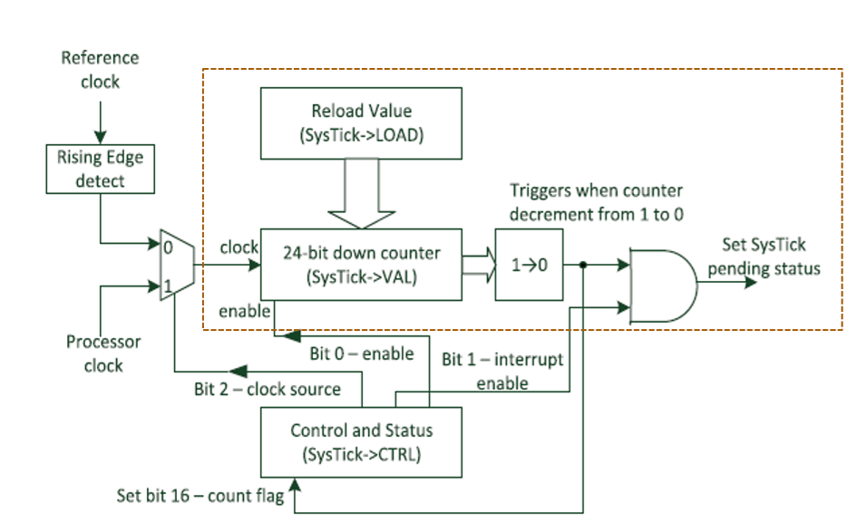

# Pre-LAB: SysTick&#x20;

Name:

ID:

## I. Introduction

In this tutorial, we will learn how to use SysTick interrupt. We will create functions to count up numbers at a constant rate using SysTick.

The objectives of this tutorial are how to

* Configure SysTick with NVIC
* Create your own functions for the configuration of interrupts

### Hardware

* NUCLEO -F411RE

### Software

* VS code, CMSIS, EC\_HAL

### Documentation

* [STM32 Reference Manual](https://ykkim.gitbook.io/ec/stm32-m4-programming/hardware/nucleo-f411re#manual-documentation)
* [STM32 Programming Manual](https://www.st.com/resource/en/programming_manual/pm0214-stm32-cortexm4-mcus-and-mpus-programming-manual-stmicroelectronics.pdf#page=246.10) 


## II. Basics of SysTick

### A. Register List

List of SysTick registers for this tutorial. [STM32 Programming Manual](https://www.st.com/resource/en/programming_manual/pm0214-stm32-cortexm4-mcus-and-mpus-programming-manual-stmicroelectronics.pdf#page=246.10) 




### B. Register Setting

**(RCC system clock)**

1. PLL, HCLK= 84MHz

**(System Tick Configuration)**

1. Disable SysTick Timer

`SysTick->CTRL ENABLE=0`

2. Choose clock signal: System clock or ref. clock(STCLK)

`SysTick->CTRL CLKSOURCE = 0 or 1`

3. Choose to use Tick Interrupt (timer goes 1->0)

`SysTick->CTRL TICKINT = 0 or 1`

4. Write reload Counting value (24-bit)

`SysTick->LOAD RELOAD = (value-1)`

5. Start SysTick Timer

`SysTick->CTRL ENABLE=1`

6. (option) Read or Clear current counting value

`Read from SysTick->VAL`

`Write clears value`

**(NVIC Configuration)**

1. NVIC SysTick Interrupt priority
2. NVIC SysTick Enable

***


## III. Register Exercise 

### Exercise 1

Fill-in the blanks. Refer to the [programming manual](https://www.st.com/resource/en/programming_manual/pm0214-stm32-cortexm4-mcus-and-mpus-programming-manual-stmicroelectronics.pdf#page=246.10) 

Try to do it by yourself, without referring to `ecSysTick2.*`

```c
void SysTick_init(void){
	//  SysTick Control and Status Register
	// Reset to CTRL to Disable SysTick IRQ and SysTick Counter
	SysTick->CTRL = 0;											
	// SysTick->CTRL &=~1UL<<0;											

	// Select processor clock
	// 1 = processor clock;  0 = external clock
	SysTick->CTRL |=   [YOUR CODE GOES HERE!!]


	// Enables SysTick exception request
	// 1 = counting down to zero --> SysTick exception request 
	SysTick->CTRL |=  [YOUR CODE GOES HERE!!]


	// SysTick Reload Value Register : (SYSCLK / 1000) - 1  ->  1 ms
    // EC_SYSCLK :  HSI 16 MHz or PLL 84 MHz
	SysTick->LOAD =  [YOUR CODE GOES HERE!!]

        
	// SysTick Current Value Register : Reset counter value to 0
	SysTick->VAL = 0;
	
	// Enable SysTick IRQ and SysTick Timer
	SysTick->CTRL |= SysTick_CTRL_ENABLE_Msk;
		
	// Enable interrupt in NVIC
	NVIC_SetPriority(SysTick_IRQn, 15);		// Set Priority to 1
	NVIC_EnableIRQ(SysTick_IRQn);			// Enable interrupt in NVIC
}


```


### Exercise 2

Understand how the following code works 

```c
volatile uint32_t msTicks;

// SysTick_Handler() is called every 1 ms by the SysTick IRQ
void SysTick_Handler(void){
	SysTick_counter();	
}

// Increment msTicks every 1 ms
void SysTick_counter(void){
	msTicks++;
}	

// Blocking delay in milliseconds
void delay_ms (uint32_t msec){
  	uint32_t curTicks;
  	curTicks = msTicks;
	while ((msTicks - curTicks) < msec){;}		
}

```


## B. Tutorial  Code

This is an example code for turning the LED on/off with a delay function 

#### Procedure

* Download the header library files and save under `include\`.

  * `ecSysTick2_student. ecSysTick2_student.c`:  [Click here to download](https://github.com/ykkimhgu/EC-student/tree/main/include/lib-student)
* Rename the files as `ecSysTick2. ecSysTick2.c`

* Create a new project under the directory `EC\tutorial\`
* Environment : `env:TU_SysTick`

  Source file: `TU_SysTick_student.c`

* Modify the `**platformio.ini**` **,** to add new environment.

  

#### Example Code 

* Understand the codes in `ecSysTick2.h`

* Run the program to validate your library 
* Check if it gives an accurate delay timing

```c
/*----------------------------------------------------------------\
@ Embedded Controller by Young-Keun Kim - Handong Global University
Author           : [ YOUR NAME GOES HERE !!!!!]
Created          : 05-03-2021
Modified         : 09-09-2026
Language/ver     : C++ in VS Code

Description      : Tutorial - [Your Description GOES HERE !!] 
/----------------------------------------------------------------*/


#include "stm32f411xe.h"
#include "ecRCC2.h"
#include "ecGPIO2.h"
#include "ecSysTick2.h"  // < --  added !!!!

#define LED_JK PB_12  // LED for Eval Board	JKIT

void setup(void)
{
	RCC_PLL_init();                 // System Clock = 84MHz	
    SysTick_init(); 
   	GPIO_init(LED_JK, OUTPUT);       // LED for Eval Board	JKIT    
}


int main(void) {	    
	setup();
	while(1){
            GPIO_write(LED_JK, HIGH);        
        	delay_ms (1000);
	        GPIO_write(LED_JK, LOW);        
	        delay_ms (1000);        
	}
}

```

