# Tutorial: Install CLion IDE

Optional IDE for Embedded Controller
------------------

**개요**

* [CLion Install](#clion-install)
* [PlatformIO Install](#platformio-install)
* [Create PlatformIO Project](#create-platformio-project)

------------------

# CLion Install

## I. 특징

Jetbrains 사에서 만든 C/C++ IDE이다. C/C++만 전문적으로 지원하며 CMake 기반 프로젝트에 특화되어 있다. 또한 개발 환경을 기본적으로 제공하기 때문에 컴파일러 설치 등에 수고를 덜 수 있다.


### 장점

1. **유저 친화적 GUI**
   컴팩트한 GUI를 가졌기 때문에 VScode처럼 간결하다.

2. **크로스 컴파일 지원**
   Windows, Linux, Mac을 모두 지원한다. 다양한 OS에서 개발할 경우 위의 VScode와 함께 좋은 선택지다. VScode와 달리 Docker나 WSL과 같은 가상환경을 함께 사용할 때, 원격으로 접속할 필요 없이 환경만 로딩할 수 있다는 장점도 가지고 있다.

3. **강력한 코드 분석 도구**
   코드 분석이 빠르다. 함수 및 변수가 사용된 지점을 찾거나, 전체 코드에서 원하는 부분을 찾는 경우 상당히 빠른 속도를 자랑한다.

4. **편리한 디버깅 도구**
   디버깅 결과 중 중요 변수들은 인레이 힌트로 제공된다. 또한 디버깅창이 직관적인 편이다.

### 단점

1. **졸업하면 유료**
   학생들에게는 무료로 제공하지만, 졸업하는 경우 유로다. 월 9.9\$(연 99.0\$)이며 학생때 사용했다면 40% 할인을 받을 수 있지만, 정기적으로 구독료가 소비되는 것은 단점이다.

2. **느린 초기 로딩 속도**
   분석에 필요한 데이터를 프로젝트 로딩 단계에서 가져오기 때문에 초기 로딩 속도가 느려진다. 한번 로딩 되면 상당히 빠르지만, 로딩 중 시간이 상당히 소요된다.

3. **CMake 학습 필수**
   크로스 플렛폼 지원을 위해 CMake 빌드를 기본으로 가정하고 제작된 IDE이다. 그렇기 때문에 빌드를 위해서는 CMake 학습이 필수적이다.

## II. 설치

#### 1. [Jetbrains 로그인 사이트](https://account.jetbrains.com/login)에서 회원가입을 진행한다. 학생 졸업할인을 받기 위해 가능하면 개인 이메일로 회원가입하는 것이 좋다. 회원가입 후 로그인까지 진행한다.

   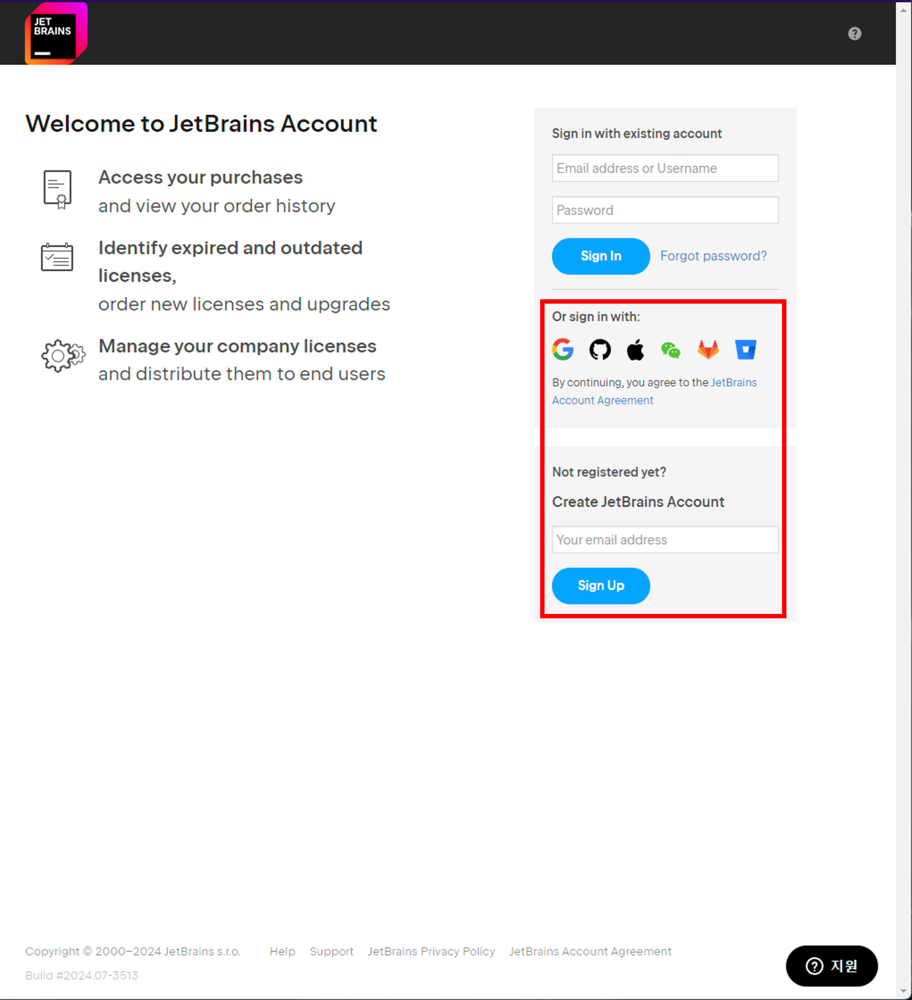

#### 2. [Jetbrains 교육 지원 사이트](https://www.jetbrains.com/ko-kr/community/education/#students/)에서 학교 이메일(handong.ac.kr)로 인증한다.

   

   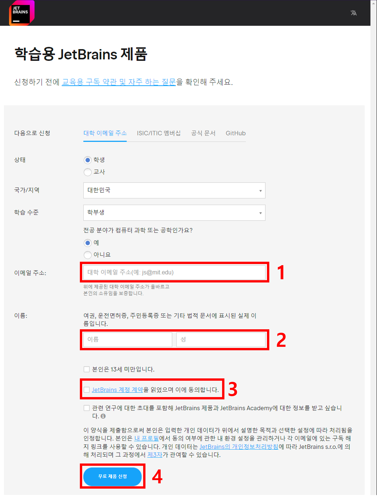

#### 3. 학생용 메일로 발송된 라이센스 규약 링크로 들어가서 조약을 끝까지 읽고(스크롤을 끝까지 내린 뒤) '**I Accept**'를 눌러 라이센스를 발급받는다.

   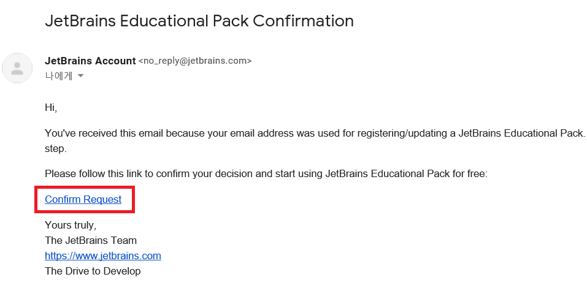

   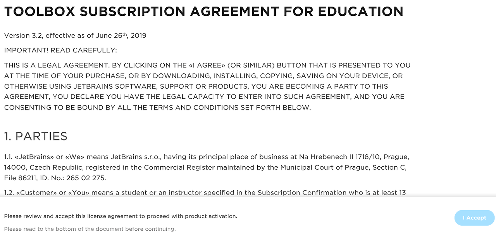

#### 4. 라이센스를 발급 받은 메일 계정으로 로그인하여 라이센스를 확인한다.

   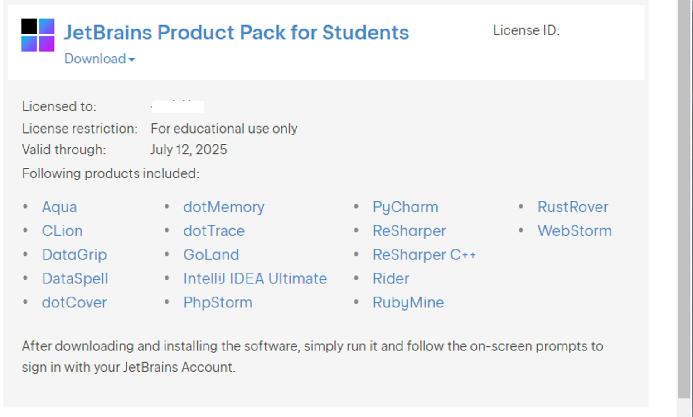

#### 5. [다운로드 사이트]((https://www.jetbrains.com/ko-kr/toolbox-app/))에서 Toolbox를 다운로드 받는다.

   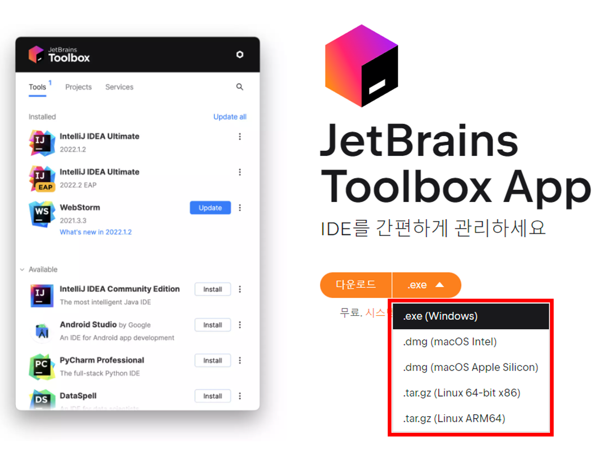

#### 6. Toolbox에서 로그인 후 CLion을 다운로드 받는다.

​      

## III. 프로젝트 설정

#### 1. CLion을 실행 후 '**새 프로젝트**'를 선택한다.

   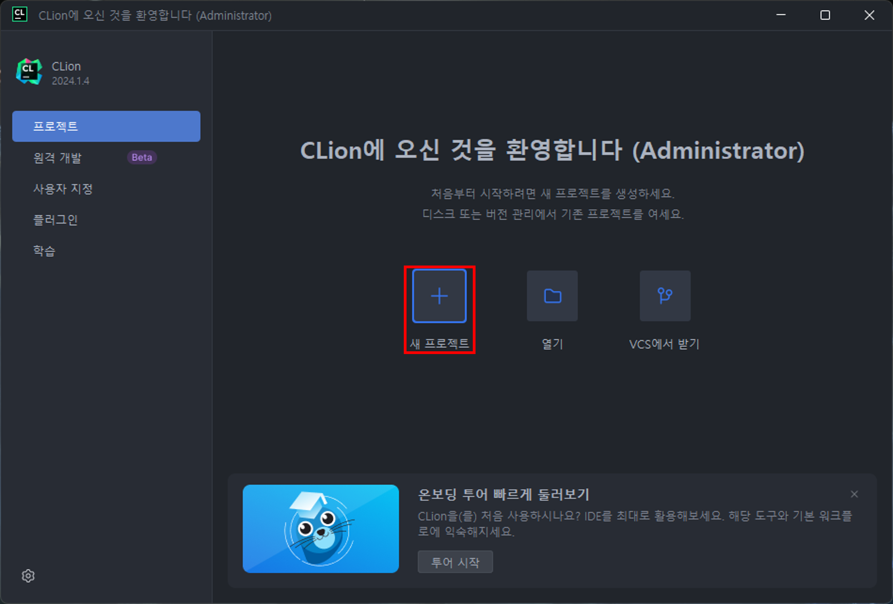

#### 2. C 응용프로그램을 선택하고, 프로젝트 경로를 설정한다. 이때 경로의 마지막은 프로젝트 이름으로 해야한다.

   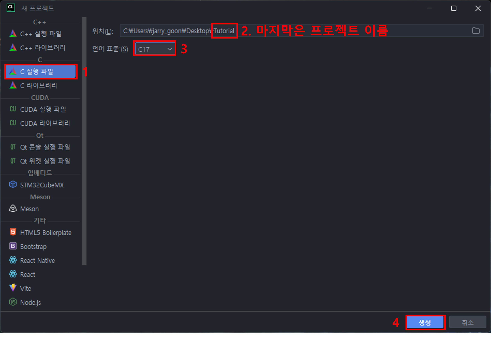

#### 3. 툴체인을 아래 사진과 같이 설정한다.(일반적으로 아래가 기본값으로 설정되어 있다.)

   | Windows                                                      | Mac                                                              |
   |:------------------------------------------------------------:|:----------------------------------------------------------------:|
   | 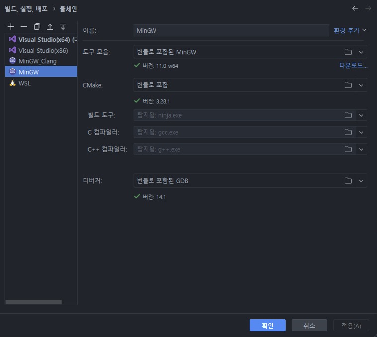 | 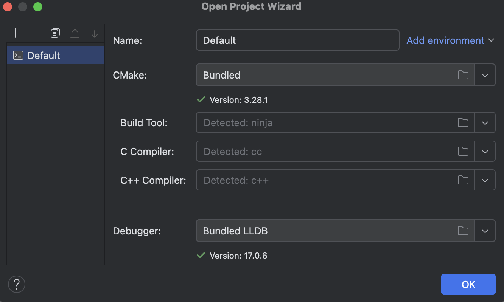 |

#### 4. `CMakeLists.txt`를 아래와 같이 수정한다.  `<PROJECT>`부분은 <u>**본인의 프로젝트 이름**으로 **수정**</u>한다.
   ```cmake
   cmake_minimum_required(VERSION 3.25)
   project(<PROJECT> LANGUAGES C)
   
   set(CMAKE_C_STANDARD 17)
   
   file(GLOB_RECURSE SOURCE
        ${CMAKE_CURRENT_SOURCE_DIR}/src/*.c
        )
   
   add_executable(${PROJECT_NAME} main.c ${SOURCE})
   target_include_directories(${PROJECT_NAME} PRIVATE ${CMAKE_CURRENT_SOURCE_DIR}/include)
   ```

#### 5. `main.c`를 아래와 같이 수정후 실행해 본다.

    ```c
    #include <stdio.h>
    
    int main()
    {
        printf("Hello World!");
    
        return 0;
    }
    ```

---

# PlatformIO Install

임베디드 시스템을 구동하기 위한 RTOS 및 필수 라이브러리를 관리해 주며, 임베디드 장치에 파일을 플래쉬 해주는 역할을 겸한다.

#### 1. Python 설치

[Pyhton 설치 사이트](https://www.python.org/downloads/)에서 파이썬을 다운로드 받는다. (버전 상관 X)


#### 2. PlatformIO Core 설치파일 다운로드

[해당 사이트](https://docs.platformio.org/en/latest/core/installation/methods/installer-script.html#local-download-macos-linux-windows)에 접속하여, 설치 파일을 다운로드 받는다.

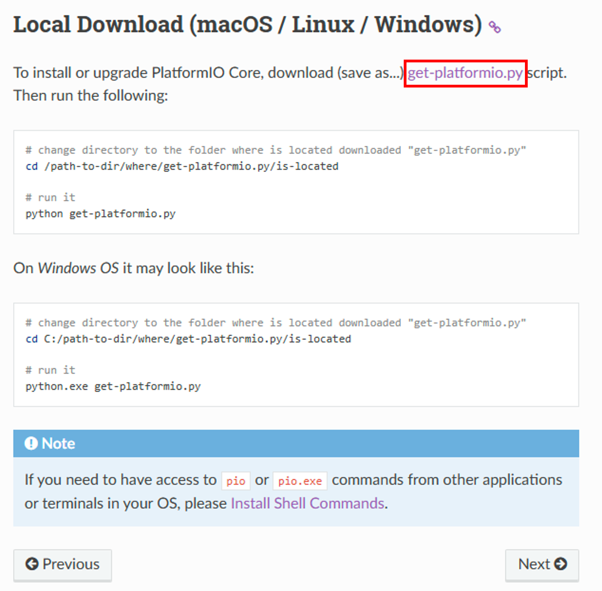

사진의 링크를 클릭하여 들어간 사이트에서 `Ctrl + S`를 이용해서 다운로드 받을 수 있다. 이때 파일 확장자가 `.py`가 아니라면 `.py`로 수정해야 한다.

Ex) PlatformIO.py.txt --> platformIO.py

#### 3. PlatformIO 설치

설치파일을 다운로드 받은 폴더로 들어간 뒤, 우클릭 하여 나오는 탭에서 터미널에서 열기를 선택한다.

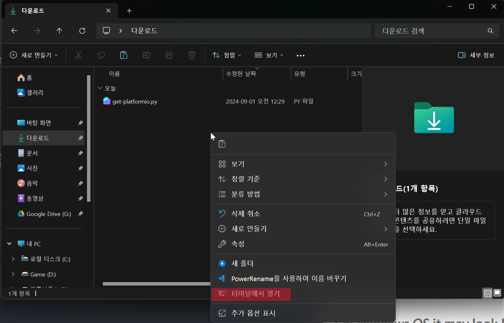

이후 터미널에 아래 명령을 입력한다.

```
python get-platformio.py
```

#### 4. CLion에 platformio 플러그인 설치

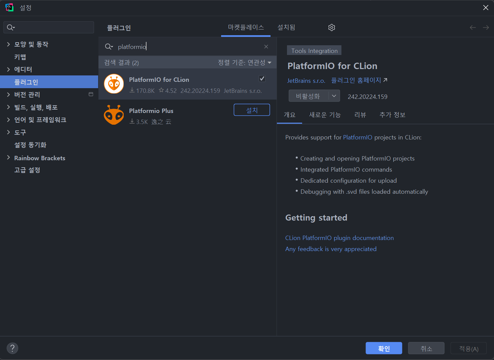


---

# Create PlatformIO Project

#### 1. CLion을 실행 후 '**새 프로젝트**'를 선택한다.

   

#### 2. 프로젝트 유형을 PlatformIO로 변경하고 사용하는 보드를 선택한다.

   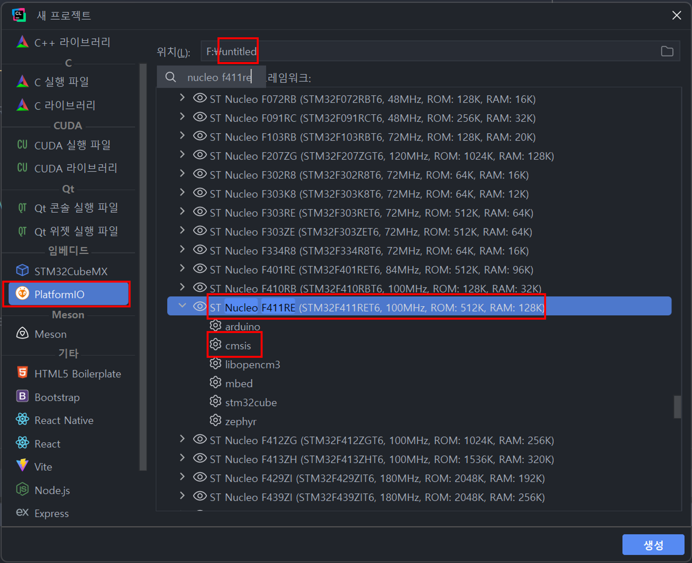

   위와 같이 선택하고 생성을 누르면 프로젝트가 생성된다.
   프로젝트 생성과 함께 필수 라이브러리를 다운로드 받기 때문에 이 과정에서 **네트워크가 연결**되어 있어야 하며,
   시간이 소요된다.

## 프로젝트 설정

   PlatformIO는 하나의 프로젝트 내부에 여러 환경을 만들고 환경별로 각각 빌드하고 실행할 수 있다.
   환경은 `platformio.ini`이라고 하는 설정 파일에서 관리한다.

   해당 파일 가장 위에 아래 내용을 추가한다.

   ```ini
   [platformio]
   src_dir = .

   # Default environment setting
   [env]
   # Board Platform
   platform = ststm32
   # Board Name
   board = nucleo_f411re
   # Software framework
   framework = cmsis
   # Debugger
   debug_tool = stlink
   # Compiler flags
   # Reference the "include" folder in all environments
   build_flags = -I "include"
   # Add all C files inside the "include" folder to the build target
   build_src_filter = +<include/*.c>
   ```

   PlatfromIO를 사용하는 경우 새로운 빌드 파일을 작성할 때, 매번 프로젝트를 만들 필요 없이, 새로운 환경을 만들면 된다.
   환경을 만들 때는 `platformio.ini` 파일 내에 아래와 같은 내용을 추가하면 된다.

   ```ini
   [env:환경 이름]
   build_src_filter = +<추가할 파일>
   ```

   예를 들어 해당 [튜토리얼](https://ykkim.gitbook.io/ec/ec-course/tutorial/mdk-uvision/adding-my-api-header-in-uvision)을 PlatformIO에서 만들 경우 파일 구조와 `platformio.ini` 파일은 다음과 같다.

   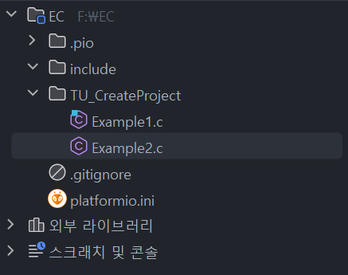

   ```ini
   [platformio]
   src_dir = .
   include_dir = include

   # Default environment setting
   [env]
   platform = ststm32
   board = nucleo_f411re
   framework = cmsis
   debug_tool = stlink
   build_flags = -Wl,-u,_print_float,-u,_scanf_float, -std=c11, -O3

   [env:TU1_example1]
   build_src_filter = +<TU_CreateProject/Example1.c> +<include/*.c>

   [env:TU1_example2]
   build_src_filter = +<TU_CreateProject/Example2.c> +<include/*.c>
   ```

## 빌드 파일 선택

   사진과 같이 오른쪽 위의 탭을 통해서 빌드 대상을 선택할 수 있다.

   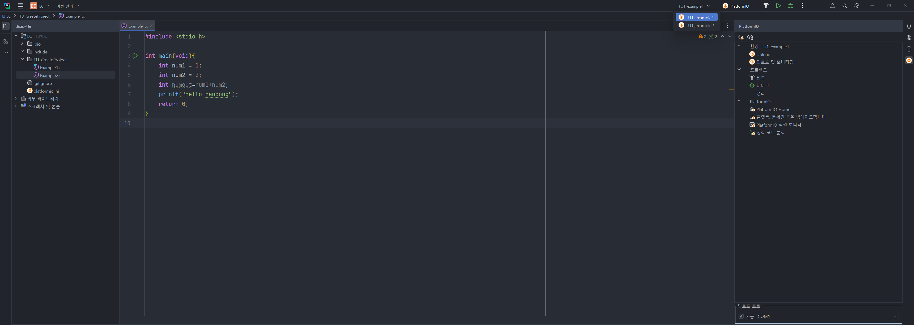

   **탭 옆에 있는 망치를 누르면 파일을 빌드**할 수 있으며,
   **초록색 삼각형을 누르면 빌드 이후 자동으로 업로드** 해준다.
   업로드에 성공하면 아래 사진처럼 나온다.

   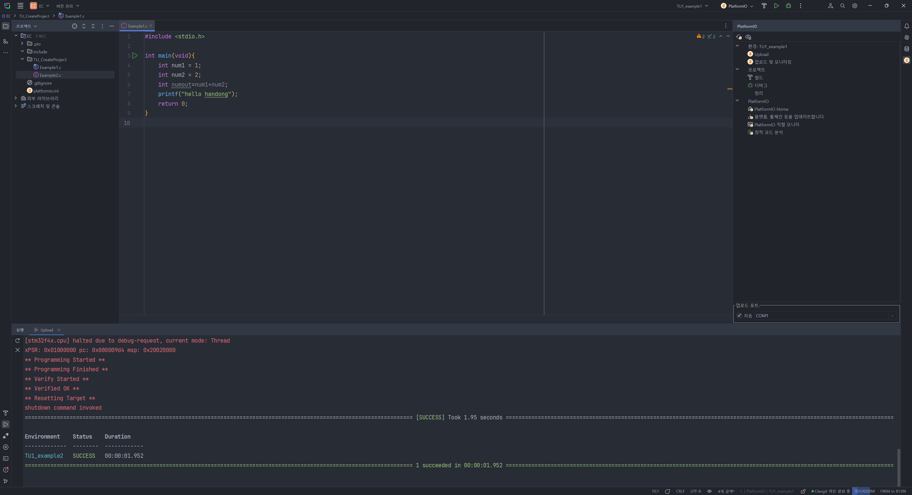

## 코드 디버그

   우측 상단의 초록색 벌래를 누르면 디버그가 가능하다.

   디버그를 위해서는 종단점을 생성해야 하며, 종단점은 코드 우측 숫자를 눌려서 생성 가능하다.

   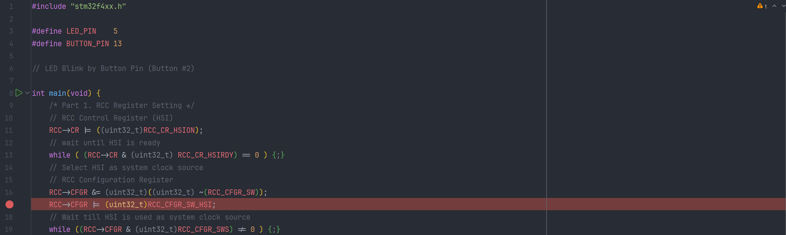

   이후 디버그 버튼을 누르면 main 함수의 첫번째 지점에서 코드가 한번 정지하고,
   이후에는 종단점에서 코드가 정지하며, 메모리 값을 볼 수 있다.
   이때 디버그 창의 `주변기기` 칸에서 레지스터 값을 직접 확인할 수 있다.

   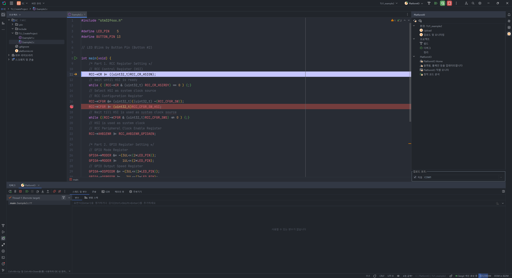

   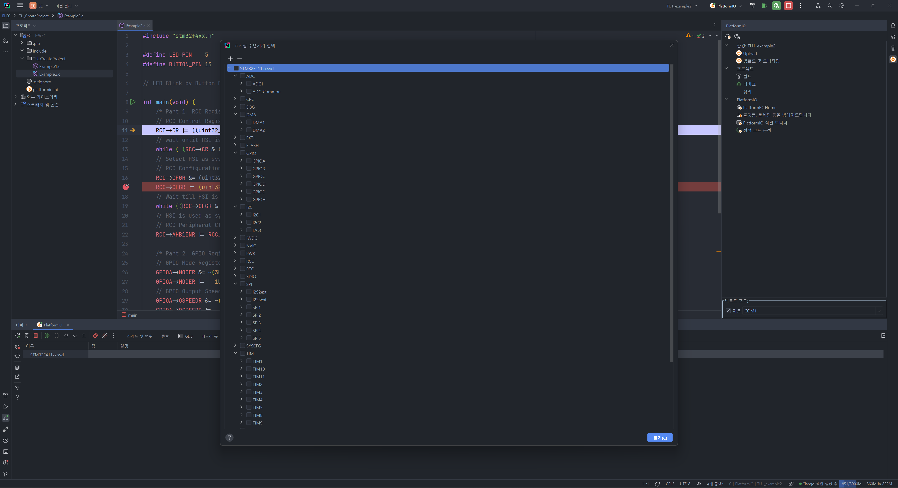

   바뀐값이 있다면 파란색으로 강조하여 알려준다.

   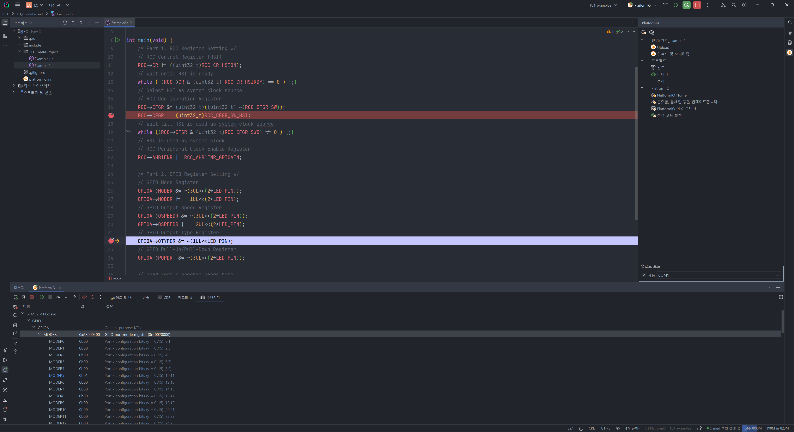

