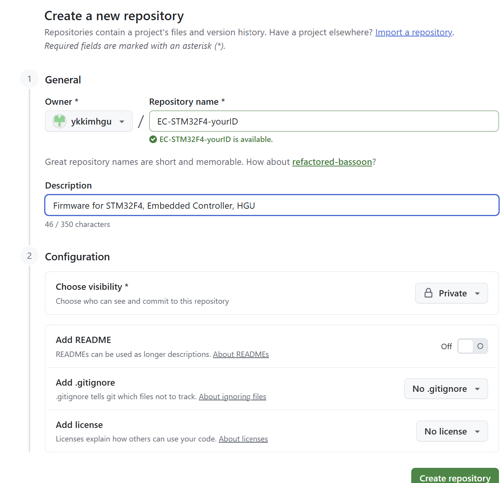
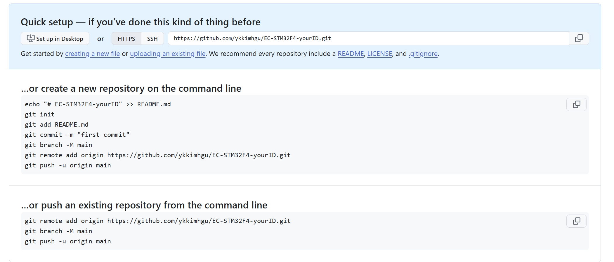
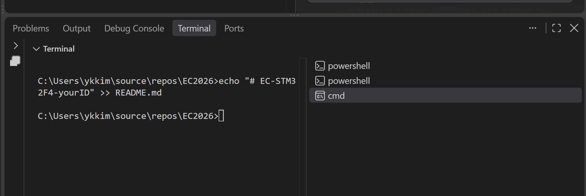
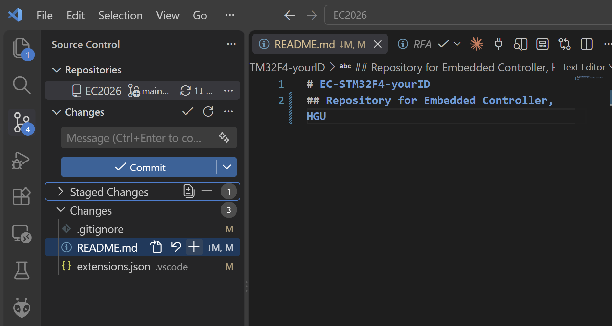
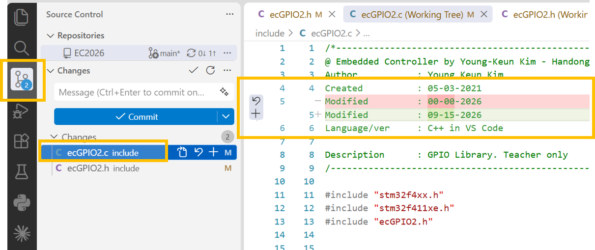
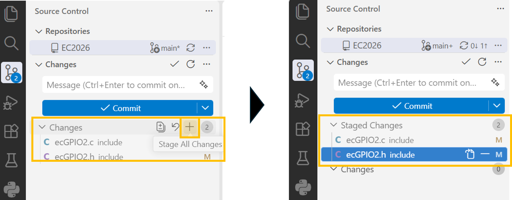
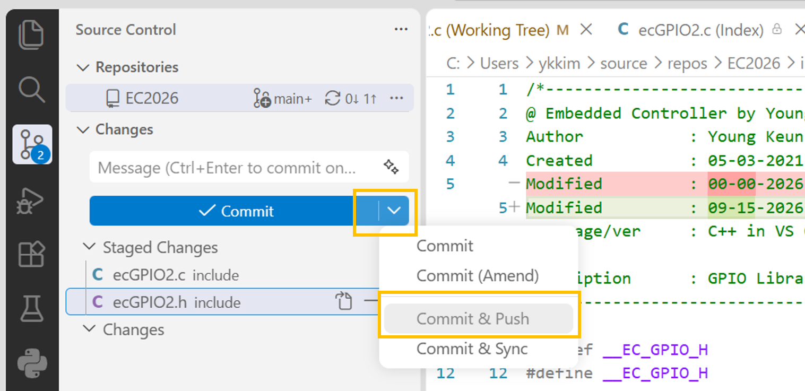
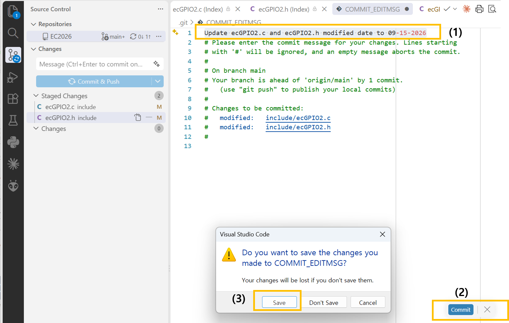

# Tutorial: Using Github in VS Code

## Introduction

We will learn how to manage and control the source code for your EC project in VS Code using GitHub.

## Preparation

#### 1) Install Git

* [**Git Download and Install (Stable Build)**](https://git-scm.com/downloads)
* Use Default settings

#### 2) Create Github Account

* [Tutorial for creating github account](https://ykkim.gitbook.io/dlip/programming/github/create-account)


***

## Tutorial

### Step 1: Create a new repository (Github Webpage, private)

* Repository Name: EC-STM32F4-yourID
  * yourID=학번으로 변경
* Description: Firmware for STM32F4, Embedded Controller, HGU
* Visibility : Private
*   Add Readme: OFF

    * Does not matter if you select ON

    

You will see the following command lines (Github Webpage)

* Select `HTTPS`
* Copy the following command lines on memo to be used later



### Step 2: Open VS Code terminal

* **Open Directory:** Open the working directory e.g `\repos\EC` in VS Code
* **Terminal:** VS Code에서 Terminal 실행 (CMD) , Ctrl+J



### Step 3: Git Initialization

This initialization is done only once by copying the commands from `…or create a new repository on the command line`

* **Remote :** Github Repos (클라우드)
* **Local:** Laptop/PC
* **Push**: Local to Remote,
* **Pull**: Remote to Local

> You have to authorize VS Code to access Github account

Select either Case 1 or Case 2

#### Initialization Case 1: Push from Local(existing) to Remote(empty)

* Pull from Local Directory to Remote(Empty)
* Github Repos가 비워져있는 상태에서 Local 내용을 Remote로 업로드 하고 싶을때
* Example: `HTTPS = https://github.com/ykkimhgu/EC-STM32F4-yourID.git` (<-- change it to your HTTPS)

```cmd
echo "# EC-STM32F4-yourID" >> README.md
git init
git add README.md
git commit -m "first commit"
git branch -M main
git remote add origin https://github.com/ykkimhgu/EC-STM32F4-yourID.git
git push -u origin main
```

*   커밋을 했을 때 최초 1회에 한해 username과 email을 입력하라는 안내 문구가 출력될 수 있습니다.

    ```bash
    git config user.name (작성자 이름)
    git config user.email (작성자 이메일)
    ```
* Go to your Github Repos in Website. Check your working local directory is pushed and visible on the website.

#### Initialization Case2 : Pull from Remote(existing) to Local(empty)

* When you want to Pull Remote(Existing Repository) to your local directory.
* Make sure the local directory is **Empty**

```cmd
git init
git remote add origin https://github.com/ykkimhgu/EC-STM32F4-yourID.git
git pull origin main
```

### Step 4: Source Control in VS Code

#### .gitignore

You can use a `.gitignore` file to exclude specific files from being uploaded. We want to commit only the source code (`.c`, `.cpp`, `.h`) and avoid pushing everything else.

What we don't want to push:

* heavy binary files, other complied files and configurations.
* test and quiz files
* others

Copy the followings in `.gitignore`

```cmd
.pio
.vscode/.browse.c_cpp.db*
.vscode/c_cpp_properties.json
.vscode/launch.json
.vscode/ipch
test
```

#### Git commands

* **Remote to Local :** Fetch, Pull, Merge
* \*\*Local to Remote :\*\*Add, Commit, Push


* 작업 영역(Working Directory) :
  * 우리가 실제로 파일을 추가하고 수정하는 공간입니다. **Git의 추적을 받지 않습니다.**
* 스테이징 영역(Staging Area) :
  * Git이 추적할 변경 사항을 올려 놓는 공간입니다. 사용자가 작업 영역에서 "**버전으로 기록할 파일**"만을 선별하여 이 곳에 올려놓습니다.
* 로컬 저장소에 커밋(Commit) :
  * 스테이징 영역에 올려놓았던 파일들을 묶어 하나의 버전으로 만듭니다. 즉, 커밋을 통해 **영구적으로 해당 상태가 기록**됩니다. 이후에는 언제든 다시 이 시점으로 돌아올 수 있습니다.

즉, 현재 프로젝트에서 (상태를 기록할) 파일을 골라 스테이징하고, 스테이징된 파일들을 커밋하여 하나의 버전으로 만들게 됩니다.

Modify any file in the local directory

* e.g. README.md

Go to **Source Control**(Ctrl + Shift + G)

* You will see a list of modified files, with 'M' indicated

#### Staging Selection and Commit

**Staging**

수정된 파일 중에서 선택적으로(혹은 전체) Commit 대기 상태로 올리는 과정

* 변경 사항의 모든 파일들에 마우스를 올리면 '+'(스테이징) 버튼이 표시됩니다.
* 작업 영역에서 원하는 파일을 골라 스테이징 하거나
* '모든 변경 내용 스테이징'을 선택해 **현재 상태를 저장할 준비를 완료**

**Commit**

* Accept the modifed files in the staging area

#### Pull-->Commit

* Check if you have updated your local directory from the Remote. 
* Apply the change to local drive

#### Commit -> Push

* Send local files to Remote server (i.e. Github repository)




# Example 

**Pull from the Remote **

* To fetch and receive  any changes in the files stored in the remote

**Modify local source files**

* In the local drive, open `ecGPIO.h` and `ecGPIO.c`. 
* Change the comment box : e.g.   change the modified date.
* Save the files
* You will see 'M' next to the file names
* Click the Source Control Icon in VS Code

**Stage Change** 

* Under `Changes` you will see a list of modified files

* When you select a modified file, you will see the highlighted section of changes
  * `-` previous, `+` modified

  



* After confirming the change, **Stage Change** all files or selected files. 

  


**Commit & Push**

* Select Commit & Push 




* Write the Message that describes the Commit (modification)

* Click `Commit` and `Save`

  

**Confirm Modification in Remote**

* Go to your github repos and check if the modification has been processed.


# Next


[tutorial-documentation.md](tutorial-documentation.md)



## Advanced Application

#### \* VS 코드에서 git 사용방법

[https://develoft.tistory.com/7](https://develoft.tistory.com/7)

#### \* 좋은 commit message 작성법

[https://jane-aeiou.tistory.com/93](https://jane-aeiou.tistory.com/93)

#### \* vscode 연동 및 branch 생성, commit

[https://parkparkpark.tistory.com/53](https://parkparkpark.tistory.com/53)
