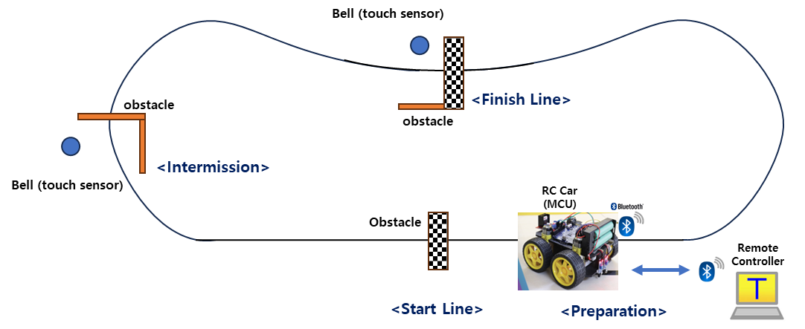

# Tutorial: for loop in C vs Matlab

## Introduction

There can be some confusion in translating a code from Matlab to C.

The most common mistake is in the for-loop syntax and index number.


### Part 1. Iteration Counting

Iterate the loop 3 times

* Total number of iteration : N

```c
// MATLAB
for k=1:N  fprintf ("hi");  end
    
// C-Prog:  Option 1
for (k=0; k<N; k++) printf ("hi");

// C-Prog:  Option 2
for (k=1; k<=N; k++) printf ("hi");
    
```


#### Example

Find the 2^4 = 16  (x=2, N=4)

<figure><figcaption></figcaption></figure>

```c
int x=2;  int N=4;  int y = 1;

// MATLAB
for (k = 1:N)  y = y * x;  end

// C-Prog
for (int k = 0; k < N; k++)		y = y * x;
```

### Part 2.  Array Index

Use the array from the kth element, a total of N elements.

MATLAB: **`for k = kst : kend`**

* Index Start: `Kst`
* Total number of array : `N`
* Index End: `kend= (N-1) + Kst`

C-Prog: **`for (k = k0; k < Nmax; k++)`**

* Index Start: `k0=Kst-1`
* Total number of array : `N`
* Index End: `kend= (N-1) + Kst`
* **`Nmax= N+Kst`**

**Problem 1:** Use the array from the 1st element, a total of N=7 elements. (e.g. 10 to 70)

MATLAB:

* Index Start: `kst=1`
* Total number of array : `N=7`
* Index End: `kend=7` // (7-1) + 1

```matlab
  A = [10, 20, 30, 40, 50, 60, 70];

  for k = 1:7  	y=A(k);  end
```

C-Program:

* Index Start: `k0=0` // 1-1
* Total number of array : `N=7`
* `Nmax= 7` // 7+0

```c
int A[7] = {10, 20, 30, 40, 50, 60, 70};

for (int k = 0; k < 7; k++)  y=A[k];
```

**Problem 2:** Use the array from the 3rd element, a total of 4 elements. (e.g. 30,40,50,60)

MATLAB:

* Index Start: `kst=3`
* Total number of array : `N=4`
* Index End: `kend=6` // (4-1) + 3

```matlab
for k = 3:6    	y=A(k);   end
```

C-Program:

* Index Start: `k0=2` // 3-1
* Total number of array : `N=4`
* `Nmax= 6` // 4+2

```c
for (int k = 2; k < 6; k++)  y=A[k]; 
```
