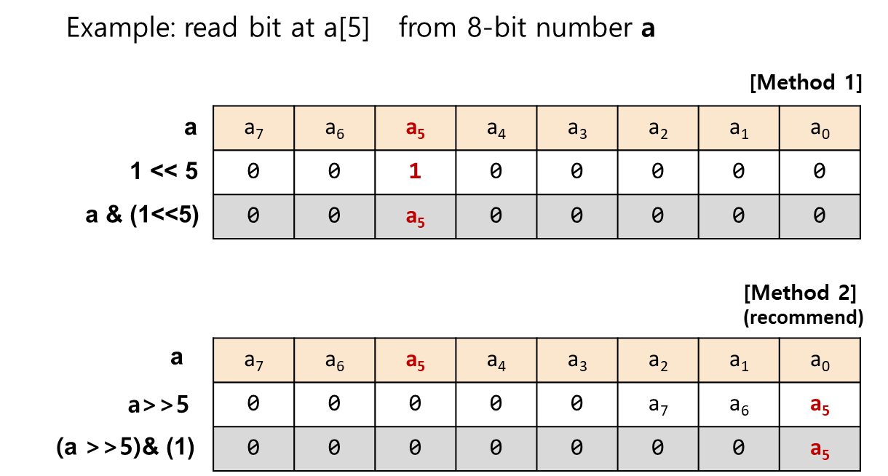

# Nucleo-F411RE

**Buton User \(B1\):**  STM32 I/O PC13 \(pin 2\)

**LED User \(LD2\) :**  STM32 I/O PA5 \(pin 21\)

The green LED is a user LED connected to ARDUINO® signal D13 corresponding to STM32 I/O PA5 \(pin 21\)

PCBSchematic File:  Click here



## Connector Pin Map

### Timer Pin Map

## ADC Pin Map

## Reference

STM32 Reference Manual: STM32F411xC/E



STM32 Nucleo-64 boards \(MB1136\)





